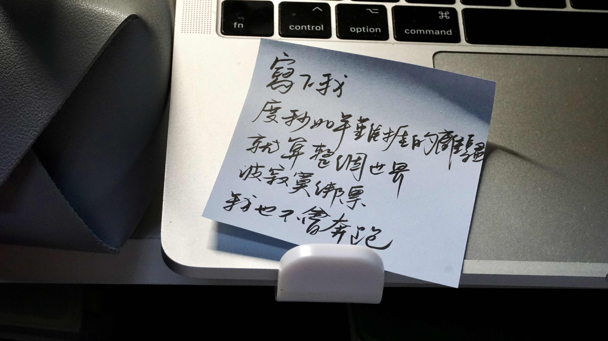

免责声明：由于逻辑过于混乱，作者本人对阅读以下文字可能造成的不良后果不承担法律责任，望周知。
## 记点日常
建立起这个文档其实是周三的事，当时突然就有一腔情绪需要抒发，然后因为觉得周三就写周记实在是太早而搁置，结果现在已经忘记了那时候要写的是什么，好吧！

某校这周突然通知可以申请离校了，很震撼的同时火速买了17号回家的机票，但是因为达达巡演后来还是改签到21号。去年没有看成的演出明年也未必能看到，所以今年一定给看了！本人也只有在这种事情上才有这样的毅力和决心（看着我空白的开题报告如是说道）

这周锻炼天数高达5天！鼓掌！发现本人要是想坚持锻炼的话，就要保证每天锻炼的内容一个视频全部搞定，因为凭我的自制力一个视频做完不可能有毅力点开第二个。尝试了一下T25，可能因为做的是Tiana省力版，虽然到最后动作七扭八歪竟然也跟下来了。只不过最开始是因为脖子太痛了才决定锻炼，锻炼过后脖子确实不痛了，但是除了脖子之外全都在痛。可能疼痛才是活着的终极意义？上次体会到这个道理还是在牙科门诊抽神经的时候，衷心祝愿各位都不要拥有这种体验，没有打麻药抽牙神经这种事觉得可以刻在本人墓碑上供路人观赏。

但压根没有墓碑的可能性会更大一些！

一个避免拖延的小经验：把需要做的事情全部写到便签条上。也许把“起床后开饮水机”都写上实在是太夸张，但也多亏于此，本周咖啡杯清洗十分及时。写到这里想起今天的杯子还没洗，啊，每天洗两个壶两个杯子真不是人过的日子，但是只用一个杯子我又不乐意，学校里的小猫都能冬天发情，寝室里的杯子为什么不能自己变干净呢？

## Kpop
本周视频：[[4K] 传说回归!?!? 一秒回忆杀 KARA的Killing Voice!](https://www.bilibili.com/video/BV1iP411T7PB)  

其实姐姐们回归已经是上个月月底的事情了，只不过最近确实没咋看kpop所以这周才看到。昨天给四五代之后才搞kpop的室友放[kara新专](https://open.spotify.com/album/6VxGMuJlJzQgxUca7zRqGk?si=BD4AtOalS924WVsrDqbIYQ)，发现我俩对这张的感觉完全不同。追星早晚对品味的塑造影响还挺大的，至少我的耳朵已经完全被二三代驯化了。今年回归的二代团能不能都去年末舞台啊，想看。

## 胡思乱想
大概是因为身边有同学被求婚成功，高中很好的朋友也把对象带回家过年，最近总是在做奇怪的梦，并不是以前偶尔会做的破案杀人追击战这种仿佛犯罪心理看多了一样的噩梦，而是谈恋爱、熟人要结婚了这类看似日常但对我来说很怪异的内容。如果是自己谈恋爱就是和对方大吵一架然后惊醒，朋友要结婚就是在说要我参加婚礼的时候惊醒。其实已经和家里说过我没有结婚生子的想法，谈恋爱本身目前也很遥远，并不是觉得人家都快结婚了我也要抓紧，是突然发现原来身边人已经逐渐变成我认知里的“大人”，好像只有我自己还在过着高中那种，每个假期最期盼的就是和大家出去玩八卦各自暗恋的人的日子。哦，我现在连暗恋的人也没有了。

说来惭愧又有些好笑，我一边向往着可以养一只小猫的独居生活，一边其实又很排斥“成长为大人”这件事，同样的还有既感觉谈恋爱很麻烦不自由现在也没什么可以喜欢的人，又也会看别人谈恋爱的时候涌出羡慕，觉得有可以依靠的人真是好。……所以群里谈恋爱的朋友们什么时候才能不在群里秀恩爱啊！！！

考雅思前在微信微博毛象到处发疯，想找一个可以看海的地方。考完雅思已经过去半个月，还是想看但还是没看。那天跟朋友们聊天，讲起过去三年发生的一些事情，感觉时间被折叠了，每天的生活仿佛是循环，没有课的备考生活甚至没有时间锚点供我标记。解封了会能跳出循环吗？我不知道。上周给妈妈打电话打到失控大吼，因为已经是连续24h核酸的第七天，当时很多人说本地的疫情管控已经够好，我们校区还可以随意出校，只是每天做核酸而已，没什么大不了的嘛，但是我就是情绪崩溃了。现在不需要核酸没那么多限制，偶尔却还有想大哭大叫的念头，为什么呢？我不知道，我不知道。连带着对室友的容忍度都下降了很多，之前可以忍耐的事情现在都会让我变得很暴躁，清晰地意识到这样不好又没办法控制住情绪，只能努力不把这种情绪表现出来。

上次和同样迷茫痛苦的朋友在酒吧聊天，探讨为什么我们要追求精英生活，探讨为什么大家一定要这么急，探讨人文社科的我们要怎么办，谁也没有答案。我们都只是想办法接着往下读书，那之后呢？她去哪里，我去哪里，我真的接受了一辈子干法律这件事吗，会不会兜兜转转发现自己只是在原地踏步，抬起头还是不知道下一步要迈向何方。为什么有人可以大一就想好自己一生的道路开始卷实习卷简历卷语言，为什么有人17岁就可以对自己的一辈子负责。  
旁边学计算机的朋友偶尔会不理解我们的想法，说实话是羡慕的，知道其实不是他的错，但在我特别痛苦的时候看他完全不纠结未来不纠结找工作的样子还是会想为什么我没学计算机，为什么我不是工科生，为什么我不是个男的？毕竟连律所法务都会优先招男生。

明明也不是要高薪，理想生活只不过是一个自己住的小房子，一只小猫，和周末有时间去看海而已。

---
> - [提问箱点这里 (o^^o)](https://box.n3ko.co/_/clear0804)
