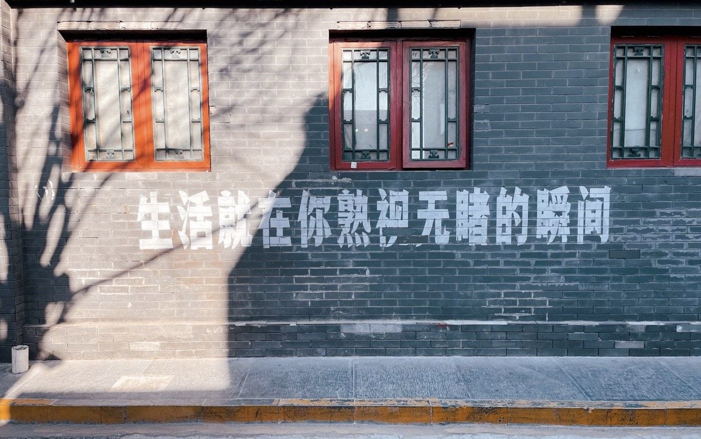

标题来自：[昨夜派对（L.N Party）- 玫瑰往事](http://music.163.com/song?id=1340627237&userid=1369261027)

从起名就开始感到为难，不知从何下笔从何谈起，一年时间消失速度之快远超我预料，反应过来恍惚发现守在电视机前看[张根硕跨年](https://www.bilibili.com/video/BV1KA411v7vP/)都已经是十年前的事。原计划是把手机里的各大app年度报告都贴上来邀请大家共赏我无趣又四海为家的一年，当然支付宝除外，目前还没有和网友们分享个人财务信息的想法。于是早上醒来第一件事就是打开b站年度报告检查。然后就发现年度视频是刑法法考课程……无语凝噎。在思考不如干脆假装无事发生删掉这篇，在昨天的周记里加上“年终总结其实没有啥可写的，在这里给各位拜个早年”结束这一切。

最后还是决定要总结下这一年，想不出关键词，所以只能翻翻相册翻翻社交软件写写流水账。

## Timeline

**一月：** 和瑞思拜各位订民宿逛山姆跨年，跨年夜当天拉圮圮给我们算塔罗占卜桃花运；微博高强度夸女儿，看了red book两遍，打花亦山心之月被游戏机制气得半死、打崩坏3每天打卡仿佛上班；又是最晚放寒假的一批人，回家之后每天睡12小时，和朋友们出去吃饭唱歌，生平第一次染了头发。

**二月：** 学了车考了科目二，被早起开车四小时&教练不开窗抽烟折磨得筋疲力尽，所幸一把过了；和朋友们去滑雪，笑话萌萌一直摔跤；仅剩的假期生活每天跑去家附近的小狗咖啡馆喝咖啡摸粘人小狗，幸福；从暖气北方回到寒冷南方，一个人在寝室找不到空调遥控板冷到坐在椅子上哭。

**三月：** 紧张兮兮地看爱的迫降，嗑玄彬孙艺珍嗑到飞起；重刷不知道第几遍healer并再次到处按头式安利；社内相亲收视率爆表，身边唯一没看完的竟是我本人；春分那天和室友去看开遍了整个公园的郁金香，那天气温已经有30度，怪哉怪哉；某日回校的路上同行几人突发奇想一起爬了六和塔，景色很美但膝盖很痛。世界上最后一个盟丝去看了水果星球演出，小智好帅。

**四月：** 假期和瑞思拜各位白天逛宜家晚上去酒吧，重感冒+酒精+高强度聊天导致了人生的第二次失声；回到了去年待过的旧律所实习，甚至连老板都是同一个，又开始了每天通勤一小时的上班生活；因为漂亮的尹净汉开始在期末考试周一天八小时看次人团综，感恩SVT赐予我许多欢乐。

**五月：** 天气晴朗的日子和学术小群一起去西区大草坪野餐拍照打扑克晒太阳；在32度的午后两点与大学生活最后一次挨千刀的十二分钟跑say bye；跑去蹦了时间不够以后的巡演，吉他手很帅，氛围很好歌也不错；入手了新的漂亮杯子，每天拎着去律所咖啡吧蹭咖啡豆喝；吃了很多很多种麦当劳新品，大多数都喜欢。我的世正宝宝出道六周年快乐。

**六月：** 和仅剩的一位室友每晚与白蚁搏斗；因为张根硕终于终于进组重燃了对他的爱（只能说这位哥再不进组我会脱粉）；被迫关注如何提高结婚率并写很多客套话，编一句要在群里骂三句；观看基本演绎法并狂嗑福华；和粥粥去看八三夭巡演，唱到《有一群伙伴比啥都浪漫》时意识到我依旧是2020那个义无反顾的笨蛋。

**七月：** 萌萌成功从封锁的小区逃出来，开启我们的双人三月同居生活，一起做饭散步半夜不睡觉聊自担，吃饭时看克拉克森的农场笑到躺倒，窝在沙发上switch连投影仪打分手厨房，拉着她一起去看昨夜派对的演出。四十度的天气热到人呼吸不畅，午休出门吃饭太阳仿佛在炙烤灵魂；开始攻略鹿岛千彰，先动心的是我不是他。实习终于结束！再不用上班！

**八月：** 让萌萌陪我看了今年的第二遍healer，法考复习终于迈上正轨，复习的途中看很多基本演绎法cm并打通Love Unholyc的一条线，又嗑了一遍Jeid并再次哀嚎没有中文饭可以吃，住在星露谷专心做草莓农民。每天睡很晚喝很多咖啡，守在窗前拍夕阳。有很严重的考前焦虑，在毛象痛骂行政法*n条。

**九月：** 看了秀英和池昌旭新剧之后大哭，因为这剧眼睛肿了一周。又看一遍101斑点狗。注册逆水寒开始玩，遇到很善良的队友，过本很愉快。摇到了九价疫苗的名额，在接种点被小孩吵到头疼。考前回校和室友凌晨三点不睡觉发疯。法考客观题过了。和亲爱的萌萌say bye。

**十月：** 久违回家，又在火车站狂奔。把头发染成红色，喜欢看它在阳光下闪闪发亮。和室友在主楼草坪前晒太阳喝奶茶打uno，回寝室用投影仪看教父，累了就去体育馆打羽毛球。21岁。

**十一月：** 雅思考试，找毕设导师，留学计划有变，赶课程论文。焦头烂额，焦头烂额，没法与生活破烂事和解，于是牙齿神经代替我发炎坏死。但月初看了第二场水果巡演，为数不多的好事。

**十二月：** 一半的时间在倒腾博客、倒腾博客和倒腾博客。剩下的时间里放肆打了很多游戏，看sj团综，去看达达巡演。在无人的校园里拍雪拍枫叶。回家、生病。冬天好冷，一瞬间就2023。

写的时候很清楚意识到越到后面写得越贫乏，大概是因为时间滤镜还没有来得及把发疯焦虑摆烂又无可奈何的日子们美化的很有趣，也很清楚自己最后几个月状态的一落千丈。

以上所有加起来，就是我的2022了。

## 关于2022

想要总结一下，但是兜兜转转又绕回开头，不知道从何处说起。

一开始决定写年终的时候总觉得今年很烂，一事无成。但总结下来发现其实也做了不少事情，实习法考雅思，建了博客，把指甲也好好的养起来了。虽然状态不好，但多多少少还是收获了一些。有很多可惜的事情没有做成，没有读上多少书，年初的目标现在连面目都已模糊更不要说是完成，不好意思说是多么充实的年份，但勉强可以达到及格标准，年末没有好好收尾的一堆杂事也只能团一团都丢给2023再办。

### 谢谢你们
年度歌手spotify是世正，网易云是马里奥；年歌都是[Bonnie&Clyde](http://music.163.com/song?id=1844442265&userid=1369261027)；b站年度视频除去法考之外是[seventeen - call call call舞台 hare场](https://www.bilibili.com/video/BV17T4y1m7rW)，花钱最多的依旧是张根硕，2022游戏时长319小时，80%的时长都是下半年贡献的，没有系统统计过看过多少书和电影，也不太记得囫囵吞枣过几何网络小说与搞笑综艺。

可以说这些是我的情绪稳定器，社交圈子过于封闭带来的后果就是无人可以提供给我情绪价值，所以要一直在寻找正向情绪来源，心情不好的时候循环正宝歌单、在失眠时听马里奥四专、吐槽老张不务正业，虽然到处吃饭但是依旧定期发Jeid疯，还有意外地在2022年开始搞次。可以说2022年遇到次人并且嗑到李硕珉尹净汉实在是很幸运的一件事，看他们两个舒适地待在一起的场景就会让我也收获幸福；在年末开始看蓝家，虽然被吵得耳朵痛痛但是多亏了他们每天很轻松地入睡。

虽然让我的钱包空空，但是过去一年感谢让我收获了这么多快乐，新的一年也多多关照吧~



### 痛苦是本色
但2022年给我的感觉一直就是，在痛苦的基底上寻求快乐的方法。为了写timeline翻微博的时候，看到之前转的微博消失了八成。铁链女、乌衣、四月之声、封控期间的苦难、白纸运动……电车难题，大家不过都是被绑在铁轨上的人罢了。一度想过把自己活成信息茧房，也在毛象的简介里写道“不关注社会新闻”，但苦痛是无孔不入的，无法忽视也做不到忽视。

幸运的属于没有受到太多波及的那批，封控防疫在物质上的伤害对我而言并不比40度的夏天难熬多少，但精神上要严重得多，物质上很多人艳羡没有受到多大影响，但精神上已经被掷入油锅三年。坐在椅子上会无缘无故想吼叫或流泪。想的最多的就是“有必要吗？” 无论是常态化核酸、封控、健康打卡或是周围人一直在追求的精英生活。去小礼堂做核酸的那段日子时常会有投身于山林的想法，刚开始还尝试着把自己从悲观泥潭中拔出来，向朋友圈一些在朝九晚十一的实习期里还能找到生活乐趣的朋友们学习。后来干脆利落地放弃了，找好定位才是人生的关键，我就是那种过着朝九晚五生活也要炸掉地球做回自己世界毁灭的人，找不到与世界和解的方法，其实也没有什么和解的必要。

任何事情的解决方法都可以参考我那颗蛀掉的牙：和平时相安无事、疼痛时忍耐、承受不住就去抽离神经。死神经是救不活的，所以没有第二种选择。

## 关于2023

其实最想坚持的事情是daily和周计划本，虽然我已深知本人坚持不下来的懒散本质且非常有先见之明地买了自填日期，但2022年的空余期还是多到让人心怀愧疚。更别提甚至把周计划本忘在家里长达三月。已经不像高中那时可以长时间手写日记，所以日记本基本也已经三天打鱼两天晒网式工作，日常记录几乎由本站全权接手。所以新的一年希望可以坚持这一点点的手写份额。

其实是个对生活毫无规划的人，没有周计划月计划更别说是年计划，但年终总结写到这里如果不立新年flag总是会觉得少点什么，看塔塔去年年终的时候看到很有趣的flag形式，今年也准备借用这个：

1. **如果只能做一件事，想做什么？**   
 想把德语学到C1

2. **如果能做三件事，想做什么？**  
 稳定更新博客；学一点韩语；平衡爱好与学习

3. **如果能做六件事呢？想做什么？**   
 六件事，好大的一个数字——给博客换一个新的漂亮主题并好好装修一下；少花一点钱多存一点款；好好吃饭早点睡觉；出去看一场演唱会；与朋友们出去旅游多多见面；能成功出国的话最好啦！

4. **书影音：**   
  至少要读25本书看25部电影，立字为据！！
 
