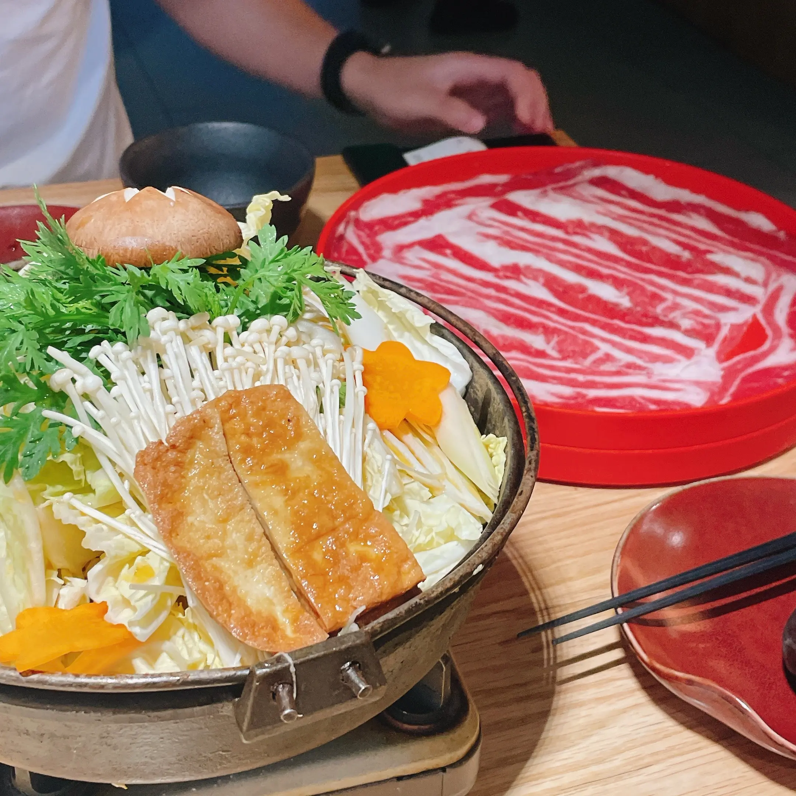

应该是建站以来更新间隔最久的一次，整个五月空空如也，久到自己都不好意思像往常一样把题目前缀写成“周记”。说忙也确实是忙，上半个月事情堆在一起，焦头烂额，焦头烂额，无数次把夜熬穿；说不忙也确实是没那么忙，在漫画和代号鸢上丢进无数小时，但总是没法静心看书写东西，于是书影音总结也没有，博客也写不出，一直拖到如今。

- 本期歌曲：
<iframe style="border-radius:12px" src="https://open.spotify.com/embed/track/6RBziRcDeiho3iTPdtEeg9?utm_source=generator" width="100%" height="100" frameBorder="0" allowfullscreen="" allow="autoplay; clipboard-write; encrypted-media; fullscreen; picture-in-picture" loading="lazy"></iframe>

## 韩国人防猝死套餐
生活作息突然变为地狱模式应该是从四月末审核部发的邮件开始，本以为APS还有段时日，结果被安排在论文交稿与答辩之间的16号。于是五月日历上的行程瞬间拥挤起来：8号交论文、13号学校英语水测口试、16号APS面谈、20号论文答辩。

之前好像也提过，我并不是能从容应对这类情形的性格，事情堆在一起只会情绪崩溃彻底摆烂。论文一直断断续续写了半个月也不过刚刚一半，然后再在ddl仅剩两天的时候和朋友们凌晨开视频会议共同赶工。APS材料一天也翻不过几页，最后在面谈时运用蹩脚英语胡乱发言。贴一下当时论文赶工时的备忘录：

> 现在是五月七日凌晨三点二十分，距离我发誓不写完核心观点不睡觉已经过去三小时，而核心观点部分完成不过三分之一。这是本人作为p人对自己效率的又一次估计失败，而这样的失败在过去的半个月里发生过十五天，这样的熬夜在过去的十五天重演过不下十次。只有今天是在写论文，前面都是沉迷漫画不想睡觉而已。

具体的焦虑和崩溃不想多述，因为以上各项结果出乎意料的都还不错，那些痛苦虽然历历在目但现在回看也都一笑置之。只是不知从什么时候养成了开始在重要事务前熬夜的习惯，很怪异且难以让人理解。在挂掉于女士嘱托“早点休息”的电话后睁眼到三点，越重要睡得越少，APS面谈前那晚只睡了四小时。这仿佛变成了我保持精神集中的另类方式。实则并不是精力旺盛到不需要睡眠的那类人群，反而应该分类到每天至少8小时睡眠拥护者，却在这些时候一边吃被称为韩国人防猝死套餐的保健品集合一边把夜熬穿。

熬夜、喝酒、冰美式、吃保健品。现在的生活状态与韩国人真是只差了一个凌晨去健身房。

## 盛夏日花露水盛宴

- 依旧提醒： 以下含有大量图片

答辩后不更新是因为在焦虑地等待APS结果，连漫画都看不下去的日子更是写不出博客；而结果下来后还没有更新的原因就是：跑出去玩了！这应该是我大学四年来头一次把电脑移出行李清单，再没有社团组织的工作要担心，也没有论文考试要准备，也心安理得不写博客。自己跑去了镇江和苏州，看演唱会顺便旅行。

不过写到这里因为打了几把游戏打累了，现在真是很容易累……先把图片贴上来，具体等有力气再接着写。依旧是竖着看的图片集！

    

        
        
        
        
        
        
        
        
        
        
        
        
        
        
        
        
        
        
        
        
        
        
        
        
        
        
        
        
        
        
        
        
        
        
        
        
        
        
        
    

 
