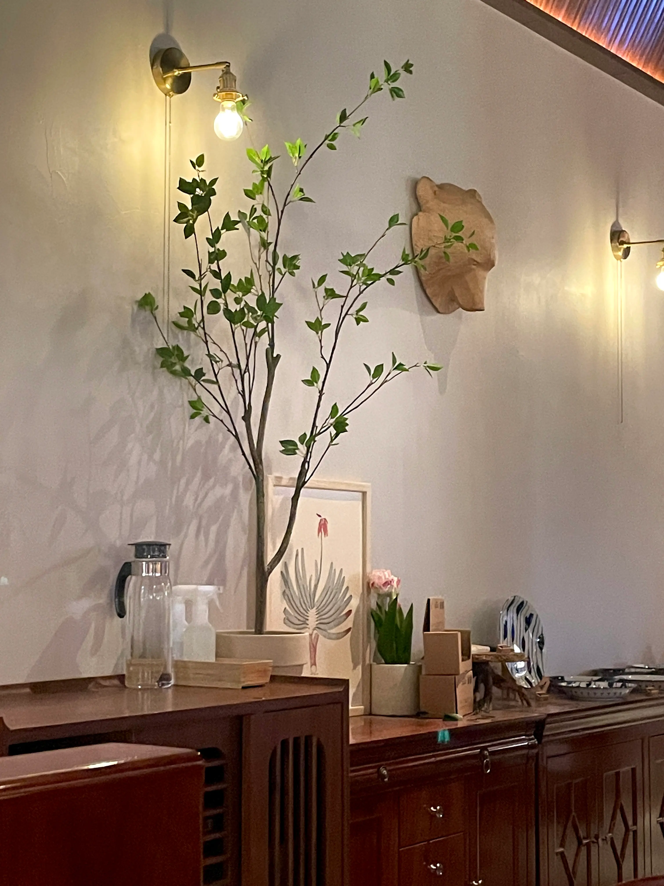
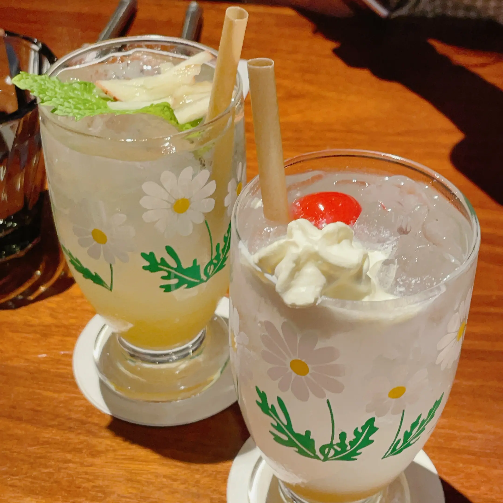
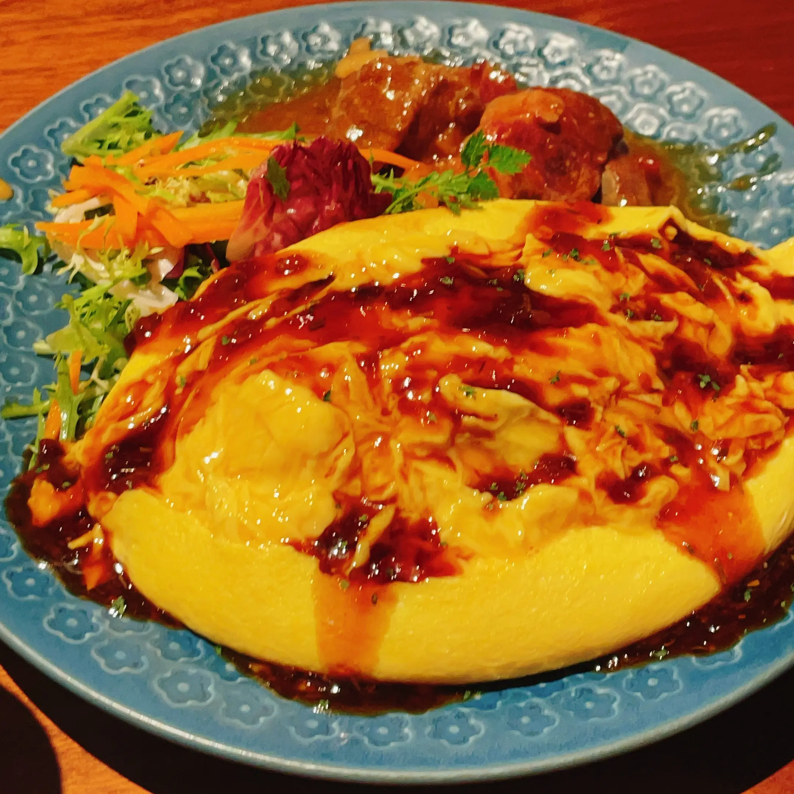
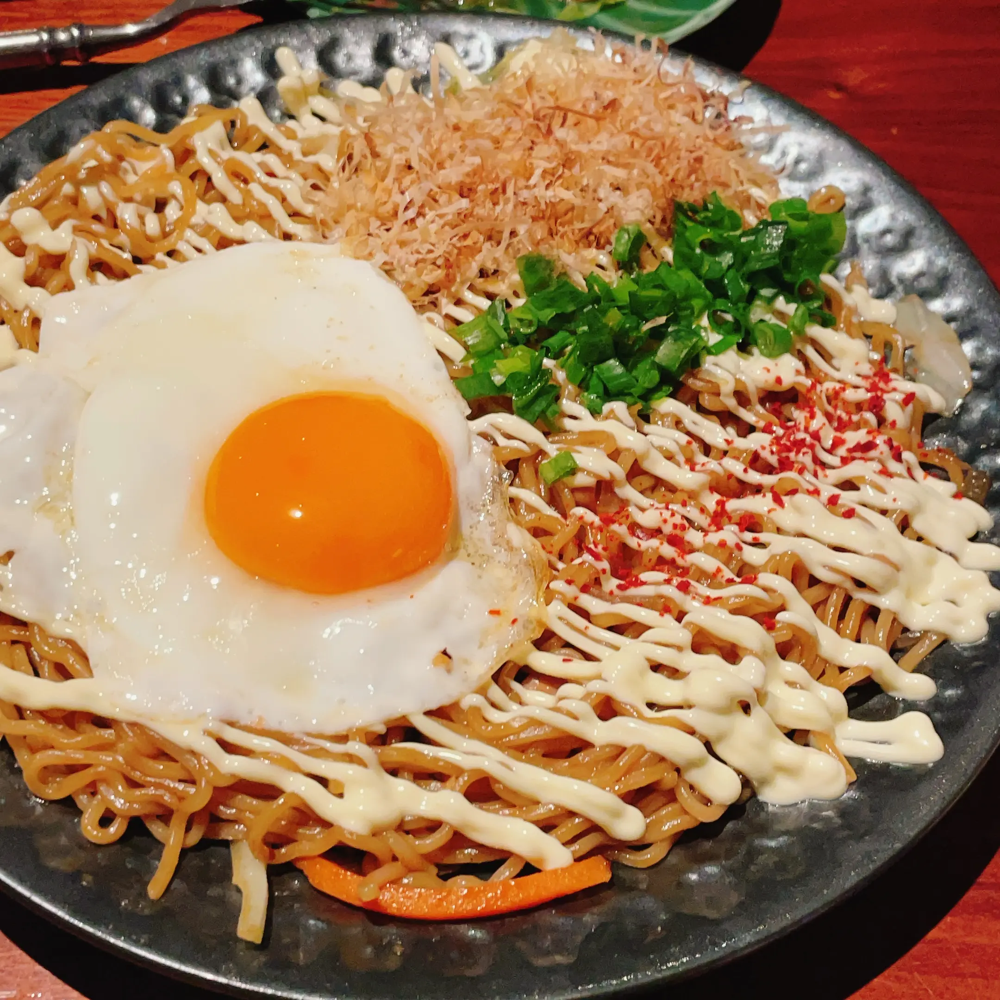
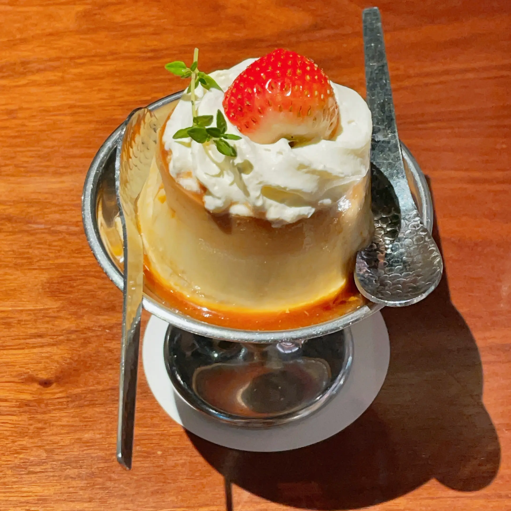
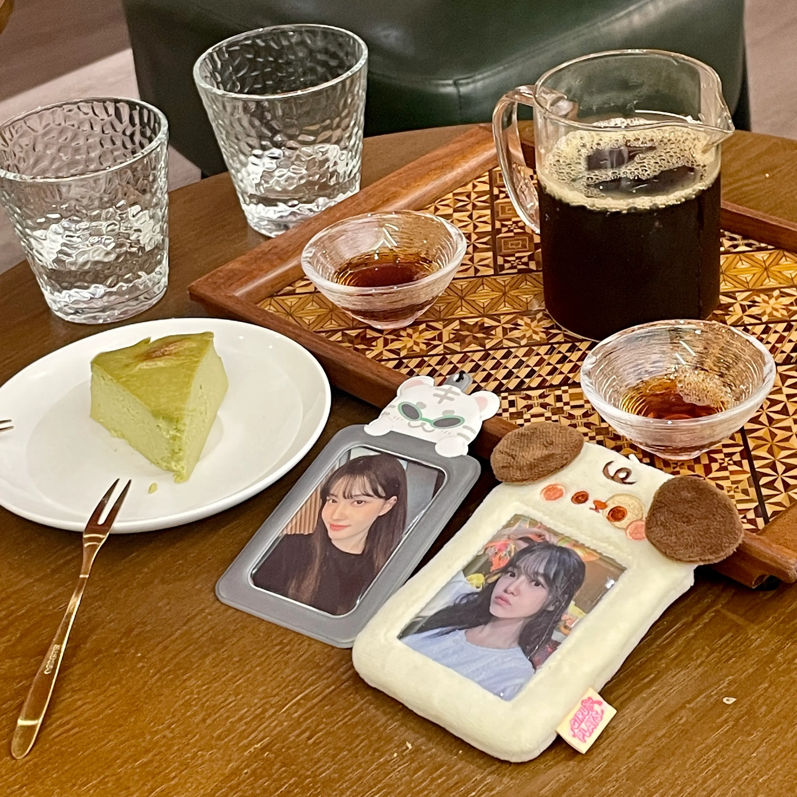
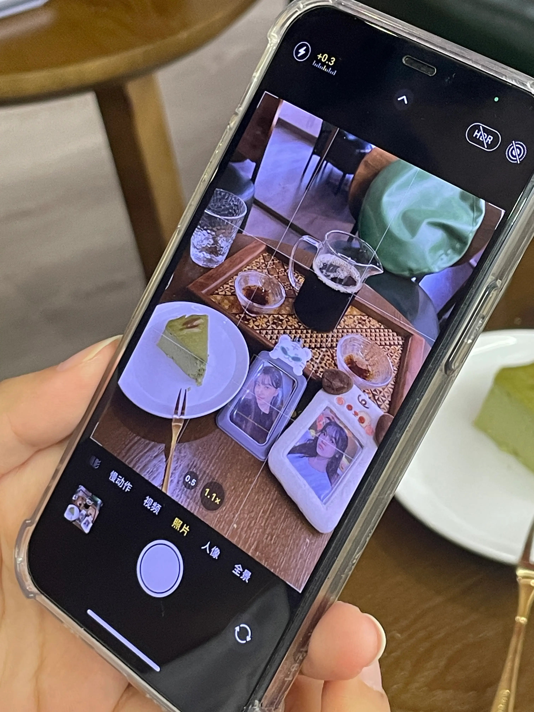
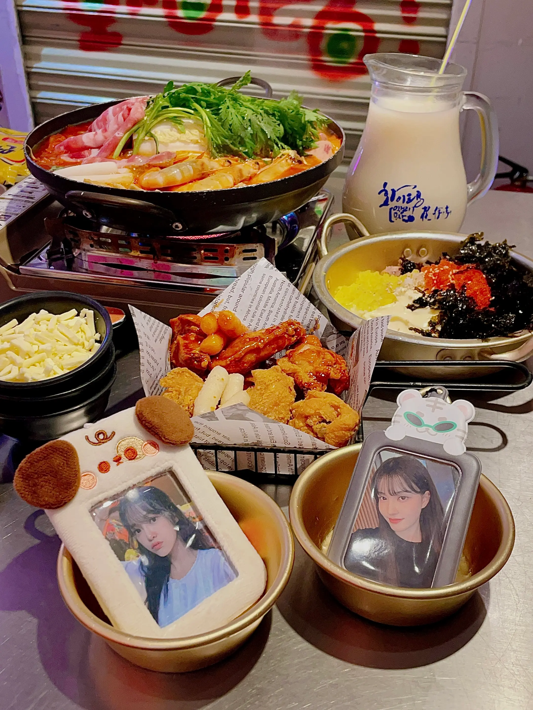

从周记拖到半月记又拖到月记，再到现在实际上的两月间隔，记录这件事本身都逐渐变得陌生，建好文件良久也想不出合适题目。第一个月乏善可陈，正如上篇工具箱提到的，虽然复习时间不过寥寥，生活主旋律完全是备考与发疯。第二个月生活有些丰富过头，导致情绪像跳楼机运作一般上下起伏捉摸不定，仅靠一句话又很难完全概括。啊呀，起题目好难，写完再说吧。

---

## 从秋天回到夏天

九月末跑去港深短期旅行，说是旅行，实际目的只是看正宝演唱会，景点和打卡地丝毫不在意。因此本来会以为几天的行程会无所事事，自己跑去海边躺个两天。但朋友都按时上学只有我在gap的好处就是到哪里都能找到人玩，出发前就跟在香港的肠肠和在深圳的薯约好要找他俩吃饭和到处乱逛；在象上吐槽深铁空调的时候发现Muko也在深圳，于是很愉快地面基吃饭喝咖啡给小卡拍照在公园躺着。见了很多人也去了很多地方。度过了有点辛苦但十分幸福的时间。

具体行程为：
- 9.28晚到达；
- 9.29香港漫无目的散步+世正演唱会；
- 9.30象友贴贴；
- 10.1和薯聚餐，晚上返程。

### 那么住哪
中秋十一假期，听起来就是承担不起的酒店价格，香港的酒店随便一搜就大几百块，贵到不如干脆在朋友合租房客厅地板简陋睡下，是万万住不起的，于是一开始就抱着看完演唱会直接回深圳的想法。苏州青旅初体验后对自己的睡眠质量和住宿接受程度有了新的认识，便定了个深圳评价还不错的青旅，叫笨猪，位置很便利，楼下就是地铁，距离机场也就半小时地铁路程。

青旅在写字楼里，一共有三层，卫生条件还不错，洗漱也不太用排队，有女生专用的卫生间。卫生间里有洗衣机，洗衣机和厨房都是用一次5块。长住客人不少，一楼的客厅晚上大家会聚在那里玩狼人杀，参与过一次，还挺有意思的。一起吃饭爬山看电影的活动也很频繁，不过我都没参加，老板还请我喝过一杯看起来很昂贵的金酒。虽然社交于我而言是一种掉电，但是体验这些还蛮有意思。

缺点相应的那肯定就是：吵。我住在一楼靠近客厅和卫生间的四人间，熬夜至一两点时依旧能听到客厅传来的吵闹声，隔壁的洗衣机也在十一二点还转个不停，虽然会赠送耳塞和眼罩，个人而言还是不会推荐给睡眠质量不好的人。

另一个点就是客人还是以男性居多，老板也是男性。可能是我对男性的容忍程度实在是太低，聊得稍多一点就会感到些微无语和难受，头上时常冒出流汗黄豆头气泡。不过如果压根不跟他们social的话问题也不大。

### 迷路也算一种探险
演唱会晚上八点半才开始，计划和肠总进行一个香港漫无目的地乱逛和狂吃。时间看似充裕又有点紧迫，所以早上八点就爬起来（前一晚明明三点才睡）。到科技大城市的机会难得，出关前决定抓紧时机先去把晚上用的小卡片机镜头上的顽固沙粒去掉，坐了一小时地铁到达红薯上推荐的修相机店铺后得知，沙粒比想象中还要更加顽固，需要整机拆开彻底清理，耗时长达两小时。根本来不及，最后还是凑合着用了，到现在也没修。

说是香港一日行但其实并没行什么，幼时来此的记忆已经很模糊，印象深刻的只剩迪士尼精彩的4d动画和那表带磨损严重的米老鼠手表；这次依旧没什么很想去的地方，对于物价倒是有了更深刻的体会，臭外地的刚出关一小时就被40块的地铁费打了一个趔趄。和肠总时隔三个月的见面更让人心情激动些，也是香港行除了演唱会之外最重要的事情。

肠总去hk的一个月里，在群里发的最多的就是“轻轻地迷路了“。本人同为路痴属性拉满，也很久没迷路如此频繁，对香港街道的蜿蜒曲折十分好奇，而它也确实不负众望。肠总和我初见一小时的时光里，俩人只干了一件事：找路。

很难判断是因为我们太笨或是谷歌地图太难用，还是香港就是一个让人容易陷入迷茫的都市。光在尖沙咀地铁站找到正确的方向就花费良久，而尖沙咀大的像机场，只能安慰自己空腹有氧瘦得快。费尽千辛万苦上到地面后又迷路第二轮，发现想吃的饭店人满到溢出不得不另寻出路，搜到的商场却又不知道哪个方向才是正确答案，我在鸭志田宫殿里都没绕过这么多圈子。迷路故事的好结局是最后去的店很好吃，环境也很舒适，本人最喜欢的反而是名字：喫茶。一直让我想到幻奏喫茶アンシャンテ，不过若Enchante真的是这个价位我万万是做不到天天去的……

    

        
        
        
        
        
    

 

吃完饭散步到星光大道那里去，然而对港片文化所知甚少，最熟悉的是那个金灿灿的麦兜塑像，仔细研究几个手印和面谱得出结论：不认识。于是专心趴在栏杆上看海。天很蓝，海很蓝，海风吹到脸上有咸腥的味道。被用烂的词藻与句式描述的场景却无论何时都让人感到幸福。



### 请一定要幸福哦

距离正宝的演唱会已经快两个月，坐在办公室里的现在我还是不知道要如何描绘，只是想想就要有眼泪流出来。如果一定要形容，那只能是：像梦一样。

有一阵子追星追得特别有执念，爱意盈满时不知道如何表达才好，隔着屏幕总感觉有缺失，买专辑冲签售代购周边，想近一点再近一点，如果能把感情直接表达给她就好了，如果能让她记住就好了。

现在回看那时，其实是自己很缺失安全感充满迷茫的一段时期，所以把感情都映射在她身上，我喜欢着吸引着我的她，也喜欢着热烈爱着她全身心投入状态下的我自己。但非常喜欢非常爱她是真的，那段时期她给了我很多很多走下去的力量也是真的。平日里的金世正可爱又明朗，有让人看着就开心的独特魔力；舞台上的、唱歌的金世正耀眼又闪亮，像小太阳一样璀璨温暖。

在等候检票进场的时候笑容想压都压不住，被肠总形容为疯了然后被拍了无数事后看起来会是黑历史的视频。却在世正出场的一瞬间就哭了。从pd101到真正见面的这七年，不论是她出现在我面前还是我走向她的路都太漫长太辛苦了。到底是在哭什么呢，哭终于见到她，还是在哭她成为我精神支撑的这些年，我也不知道。


发现自己中了合照时想象过无数次那个场景，在台下就一直掉眼泪，一度担心合照时会不会哭到崩溃。却一滴眼泪都没掉，一直笑着跟她说“행복하세요！” 
曾经觉得如果世正知道我有多么多么喜欢她该多好。现在却希望我是那么多爱她的人当中最不爱她的那一个，希望有更多人爱她。 
因为你我变得特别特别幸福，如果你因为我们的爱，变得更加幸福就最好了。




### 下载象友！
借用了Muko发嘟用过的从别的象友那里看来的文案，好喜欢这个说法，很有道理！

混迹互联网这么多年实际包括这次，一共也就面基过网友两次。感觉象是一个非常奇妙的平台，大家分散在不同的站点，却对彼此有着别的社交软件都无法提供的信赖感，好神奇。可能是因为自由自在畅所欲言网友已经见过自己精神状态最疯是什么样子了……

特别开心！明明是第一次见面却很聊得来（90%都在聊追棒子好像也没什么聊不来的），吃完饭去喝咖啡，喝完咖啡本来想去海边散步看日落，坐了公交去公园后太晒了好累，欣欣然在草地上躺下，躺一会儿又饿了然后一拍即合去吃韩料，给女宝美丽小卡拍照是最重要事务。

    

        
        
        
    

 

### 超折腾的回程
其实一号还见了发小，从小学同班开始一直到大学毕业，我们从未在不同学校过，对于“他的学校”这种说法感到很新奇，在电动车后座好好参观了一圈研究生院校。讨论了一番感情问题（他的），然后趁机毫不手软地让他请了一顿很贵的客。吃饭的地方就在世界之窗旁边，下地铁的时候：

他；要去看看吗？ 
我：有什么好看的吗？好多人。 
他：其实也没有。 
我：那别看了，吃饭更重要。 
……看来能当这么多年朋友自有它的道理。

深圳到大连的直飞航班实在是太贵太贵了，哪怕阴间时间也很贵。最后发现一个深圳-北京然后北京—沈阳的转机很便宜，只不过中间相隔九小时，可能要在机场过夜。在搜索北京机场过夜的时候发现国航联程在一些城市免费提供含早餐和机场接送的酒店住宿服务。这里就不多说了，详细链接在[这](https://www.airchina.com.cn/vaservice/loginAction/loginIndex?service=th)，如果有友友需要可以自己看下。

> 目前提供中转住宿服务的城市（机场）：北京（首都）、成都（双流）、成都（天府）、上海、杭州、天津、重庆、温州。国内转国内航段要一段是国航，另一段是国航/山航/深航。

虽然因为酒店接驳车时间间隔太长只能坐特别早的那班，最后依旧昏头涨脑睡眠不足，但短暂的几个小时睡眠在床上也总比在机场椅子上轻松舒适很多。然而等飞机到达后还要再转大巴，前一天晚上六点从青旅出发，第二天下午三点才到家。赶路真是把人灵魂都榨干，躺在床上立马就陷入了昏迷状态。

好累，但下次还去^^

## 社畜生活体验中

好吧我也不清楚是怎么走到今天这一步的，总之就是进行了进本地律所办实习律师证然后每个工作日都朝八点半不一定晚几的上班一条龙操作，周六早上九点还得去培训，美好的充满希望的gap year突然转变成悲惨社畜限时体验。本来想细说，在脑子里一项一项把优缺点罗列之后，发现上班唯一的好处就是中午可以在食堂吃饭，再不用每天吃糊弄学终极食谱：煎鸡蛋拌饭。剩下所有的抱怨无语疲惫和加班等都可以总结为：上班好烦，不想上班，想把律所炸了。

于女士其实还觉得上班蛮不错的，并不是因为家里收入来源多了我的精神损失费，即实习工资。而是她觉得上班会让我不得不早起，早起就逼着我不得不早睡。前者把我折磨得死去活来，却顽强地不肯践行后者一点。无论白天灌下多少杯的咖啡连打多少个呵欠，晚上依旧目光炯炯地熬夜，简直把我命由我不由天贯彻到极致。

律所离家自行车10分钟路程，中午吃过饭后就会骑车回家。每次午休办公室姐姐打招呼都会照例寒暄“回家睡觉了呀”，我“嗯嗯！”实际回家不是在打es2（箱活打的我有点不想活了）就是在打p5r，偶尔还会在星露谷钓鱼，五天里只有一天睡午觉，剩下的下午依旧持之以恒灌咖啡和打呵欠，传染整个办公室都传来此起彼伏的呵欠声。

归根结底都是上班的错……如果不上班我就可以九点起床，九点起床我就会睡眠充足一点都不困不需要午睡。都怪上班。

打开话匣子就感觉对于上班这件事有一万字的恨意和厌烦情绪要抒发，但这又是写不完的。只要上一天班就会积攒新一天的怨言，微信前几个表情包已经从跟朋友犯贱变成了辱骂工作。天呐，天呐，此刻缩在工位里摸鱼写博客，看着前面写下的幸福旅行，很难相信生活状态真的可以像U形管的两极一样共存又遥遥相望。

上班能收获幸福的人在哪里，我的下一次旅行又在哪里？