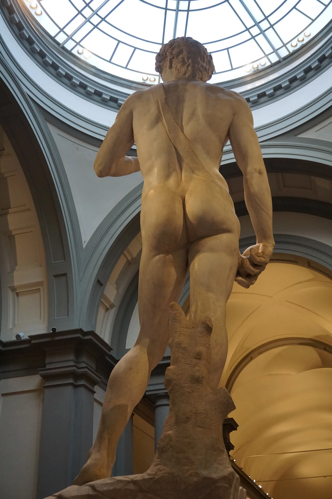

过去的两个月在各种事交织中过得飞快：跨年旅行后紧接着就是紧张的复习和自暴自弃三点睡八点起的期末月，短暂的一周间歇后又迎来了为期一月的小学期。这到底是为啥什么：朋友们在放假的时候我在上课，朋友们在上课的时候我还在上课，这不合常理啊！

## 再不写就忘光的意大利旅行
其实是十二月底一月初的事情了——毕竟是圣诞假期旅行，而我的旅行相关记录总是习惯性拖延，因此不了了之的游记也不止一两篇……新建了电子相册，这次的和之后的旅游照片都会更多放在这里：[Echo of Memory](https://foto.graugris.icu/feed)。

此次旅行的第一个经验教训是：一定要提前规划和预订。我是说走就走旅行派，在国内时临时起意的旅途不在少数，确定机酒已是所有行前准备。因此Q（我们三个中唯一的j人）提前一个半月催我和G买机票提前一个月定酒店确定行程列Excel时还觉得很新奇：这就是有规划的人吗！结果现实比想象中还严峻……怎么提前这么久就已经订不到便宜机票买不到景点门票找不到合适住宿啊，你们欧洲人对圣诞假期的重视程度真是远超我想象！

但意大利很漂亮，真的很漂亮，走在街上被一群过去只有电影中才能见到的建筑包围，走路的大家穿得时尚又美丽，是和德国（我所在的城市）完全不同的感觉，也吃了很多好吃的饭喝了很多美味的酒，有无数个发自内心发出感慨的瞬间。

但是我不准备尽述那些瞬间，也不准备推荐任何饭店，前者用文字描述太无力，而后者太像是小红书帖子——更主要的原因是我们基本在路过餐馆/咖啡厅/冰淇淋店就进屋瞎吃，也不记得几家名字……因此就写一点至今仍印象深刻的内容和一些吐槽。

---
在米兰基本上就只进行了City walk，大教堂因为排队的人太多就只在外面观赏而没有进去，不过遇到了帅气巡逻警骑马路过。可惜手忙脚乱掏硬币买水中，没有留下珍贵影像。

威尼斯是最喜欢但是也留下了最多悲伤的地方。对于这座城市的所有印象都来自于小学的课文，所以踏进时感到一阵恍惚。是真的家家户户都有船，公共交通也都是船，订的民宿在一楼，打开窗外面就是河，斜对面是一座当地小教堂。与河流众多相对的就是巷子弯曲而狭长，因为自然环境的特殊性，岛上物价也比其他地方贵很多——但是海鲜绝赞！海边景色也绝美，黄昏时分在海边散步幸福极了。

年终总结里有写，2025年的开端是从和朋友在海边看烟花开始的，我们也就是为了看跨年的海上烟花才特意选定在这个时候去威尼斯。最后的时刻聚在广场上的人群用意大利语喊倒计时期待烟花开始，结果不知道是被谁带跑了就十个数还数错了，特别好笑……而我一句意大利语也不会说滥竽充数一顿乱喊最后跟着大家一起乐，烟花结束后众人欢呼，对身边的陌生人也说Happy New Year，路上遇到的每一个人都在笑。

悲伤的事情就是出门赶火车时先是把一大包特意买的吃的落在民宿，而后又因为找不到检票机而眼睁睁看着公交船在我们眼前缓缓驶离最后不得不斥巨资坐出租船，也因此迎来本次旅行的第二个经验教训：如果在威尼斯乘坐公共交通的需求不是特别高的话，没有必要提前买日票/通票，直接刷信用卡更普遍快捷，完全找不到刷票闸机啊！坐出租船的体验倒是很罕见而且很舒服啦，就是太贵了……

---

在罗马和佛罗伦萨去了包括但不限于梵蒂冈、罗马斗兽场、许愿池、比萨斜塔等有名景点。在斗兽场和许愿池让朋友们给我拍世正同角度观光照（对不起我们追星女就是这样），在比萨斜塔给朋友们拍&围观别人拍经典视角推塔合影。以及在意大利必不可少的逛很多博物馆和美术馆——梵蒂冈博物馆和学院美术馆等。

很美，但大部分时候也是真看不懂。尤其是对于画作，可以看出它的美丽却无法理解笔触的珍贵和体会更深的意义时感觉特别可惜，太多艺术品一下子堆在自己眼前也让感官逐渐麻木，感觉自己只是一个走马观花的文盲，只能分辨出：哦这幅很有名我在美术书和历史书上见过。因此相比画作我会更喜欢博物馆美术馆里的器物和雕塑。因为他们的很多细节确实只有亲临现场看到实物才能体会到美和震撼，是图片完全展示不出的角度。

例如对于大多数非美术专业的我们来说，在美术书上就没办法看到：大卫的屁股。（好吧我承认我就是为了这张照片包的这一大盘饺子，真的很美啊！）

---

吃的虽然是乱吃但是也基本没踩雷，吃了好多好多牛排披萨海鲜烩饭意面和提拉米苏。只是意大利人钟爱番茄，甚至菜单上的卖点就有用xxx的番茄。然而我其实有些接受不了煮熟番茄的味道，番茄炒蛋是从未在家里餐桌上出现过的菜品（可以看出于女士也不爱吃），互联网热门的番茄炖万物我也从不尝试。然而这是意大利，删掉番茄约等于删掉一半菜单，因此实在没啥别的想点的也点过几回番茄风味浓郁的意面/披萨，当时觉得诶虽然远远算不上喜欢但这么吃好像也还行。直到回家自己做了蘑菇奶油意面——这才是我爱吃的啊我再也不要吃番茄意面了！当然这些都是后话了hh

## 地铁罢工为什么我不能罢学
2025年才至3月初，地铁和有轨电车就已罢工两次，第二次在写下这篇时仍处于现在进行时。第一次仅有一天，而当天本人恰好有早上九点半的期末考一场；第二回持续整整三天，而我依旧每天要去学校上课。好荒唐，我也想像他们这样肆意地活一回。

地铁是坐不了的学还是要上的打车的钱是一点也没有的——因此去坐了公交车。考试那天怕迟到因此特意提前一小时出门，结论是幸亏提前了这么久出门。站上公交时以为自己回到了杭州地铁，车辆停滞不前时以为自己回到了杭州早高峰，下车时已经因为晕车和缺氧头晕眼花。

人挤人和堵车带来的副作用就是上不去车也等不到车。虽说开玩笑觉得自己回到了杭州地铁，但是这边完全称不上是“挤公交”，虽然看起来满车的人但实际上大家都站的很宽松，等车的人若是看到车上站满了人也会干脆不上车而等下一班，哪怕下一班估计要二十分钟才到——这是迄今为止带给我的最大的文化冲击，排行榜第二名为地铁莫名其妙在两站中间停了五分钟而车厢里所有人都若无其事，德国公共交通你很坏了。

等不到车并非罢工产物，只是随着罢工而来的堵车加重了这一现象而已。已经历过好多次人站在这里二十分钟，连车的影子都没看到而导航说车已经走了的情况，这下谁能分得清等待公交和等待戈多。

初期学德语的时候学到Straßenbahn（有轨电车）和S-Bahn（市郊铁路）时，虽然明确知道不是一回事但总是没有清晰概念，来了之后我也简单粗暴把地上的车统一称为“公交”地下的统一叫做“地铁”。经历了罢工之后我完全记住了理解了不会再搞混了，Straßenbahn是和U-Bahn（地铁）一起罢工的那些地上的车，而S-Bahn是珍贵的不罢工铁路，虽然你晚点很严重……

## 近期书影音

其实Neodb短代码并没完全改不过还可以凑合着用，改的时候烦躁到差点跟GPT老师跳脚，但还是没改好，Q说是我要求太多了。天呐人家只是想要个称心如意的Neodb短代码而已又不是要欧盟护照！**没有游戏part是因为前一个半月没打游戏而后一个月又只废寝忘食在星露谷度过60个小时的农民生活…**

### 偶尔读读


写得太可爱了，从人物介绍那里“克鲁利 一个不能说堕落，更像是慢慢悠悠往下溜达的天使”就开始喜欢上了。啊呀我的性癖其实是包含堕天使的，爱上克鲁利简直易如反掌。本意是培养早睡习惯于是睡前读书结果看此本直接熬到两点，两位作者很擅长用插科打诨讲大实话，例如:

在克鲁利看来，地狱并非邪恶的蓄水池，天堂也不是仁慈的喷泉。它们只是宇宙大棋局的两个玩家。你只能在人类的头脑中找到货真价实的玩意儿，无论是纯粹的仁慈，还是彻底的邪恶。

其他人物的故事线也很有趣，出现外星人和西藏人的时候我在家里大笑，太喜欢结局了，孩子们拿着自制武器却战胜了天启骑士，拯救世界之后还要被自家老爸（养父）关禁闭，很可爱却又能用幽默触发一点思考的书，虽然已读完一个月后的今天我脑子里只剩下非典型天使和非典型恶魔这对大男同性恋…… 
因为很喜欢所以想起尼尔盖曼那档子事儿就更生气了，看过几本他的小说还买了那本很厚的随笔，还想看《美国众神》，你们男作家能不能以后写书都统一标为佚名！我将不再购入而只在zlib上找电子书……





可能因为进入文字也需要时间，读过一阵才察觉出好。喜欢朱丽叶三部曲，可能因为对爱情没啥感悟所以更被其中母女相处的细节吸引。不喜欢播弄的结局… 
第一次读门罗的时候总觉得读不懂，思索自己是不是压根没理解她的文字中想表达的深意，这次读的时候意识到阅读期间总是妄想寻找文字背后的含义才是对书写的背叛，只要感受文字本身就好。因此收获了很不错的阅读体验！还是要夸一句：门罗，好会写。


### 到处看看

事件的开端是刷到男主在惊六吐槽少女时代太吵了的片段，觉得这个人好帅好眼熟，仔细回想：哦是爱的迫降里男主的那个冷酷帅气哥！说实话我还以为玄彬比他大，还疑惑为啥他演哥哥，结果搜了一下两人同岁，这告诉我们火得太早就会被人认为年纪更大！恰好剧荒，于是搜索一下他主演的电视剧，看到这部大家都说很好嗑于是一头扎入。 女主特别可爱，男主是嘴毒没情商类型的，加之家里有钱自己有能力judge全世界别人还没法反驳，除了我们女主：我们女主不惯着一点猛猛怼回去，这下只能换男主吃瘪，看这里给我乐坏了；但是男主人设完全就是狗啊狗，疯狂skinship和kiss，看完这部再看河锡辰只觉得笑起来好憨厚……完全打破了高冷印象。后期剧情有的部分感觉有些牵强，他们执着那个截止日期时我完全挠头：这不是你们自己设的吗你俩直接不管了不就完了！到底在纠结什么！但总的来说还是很甜很好嗑的，适合当日常小甜饼摄入。 最大的吐槽点就是服道化，不知道是因为没上星还是剧组没预算，整部剧扒拉不出几套好看衣服，男主本来就黑还要给他穿黄色西装配奇葩领带，经常能变出让人眼前一亮（物理）而一黑（心理）的穿搭。





因为早就看到简介和大家的评论，所以看前面幸福的时间也一直悬着心，看到中间段果然很难过，一直在想怎么这样也有太多遗憾，但是到结尾又觉得好像这已经是最好的结局，因为种种原因错过之后，大家总要随着时间流逝往前走，可还是想说机器人真的是特别好的机器人，小狗却不是那么好的小狗TT我个人比较讨厌对于小狗和机器人的关系是“爱情”的解读，虽然可以理解但是讨厌。这种互相依靠互相陪伴的关系明明有很多种可能性，为什么要把所有这类亲密关系都说为爱情呢？这段关系具有排他性也不是直接理解为爱情的理由。 
和G跑去Q家三个人一起看的，由于都不敢看恐怖电影于是Q让我选一个合家欢的电影结果我选了这个，看完她气得大叫，让我下次选一个真的合家欢。

### 随便听听
因为太喜欢了说不出任何中肯的评价，甚至评选不出最爱曲目。Island刚出mv没出音源的时候可以硬靠着B站后台播放听一天，果然歌好听才是最牛的。

没听音源只看了打歌舞台，酒的舞蹈不用评价了无懈可击，音乐审美一直在线，舞台耐看歌也耐听，之前听了她和Christopher的几首合作曲，也很入耳。是我们昂为数不多还在做爱豆的成员了，好难得。

听了全专但是非主打基本都忘了（对不起）。Power刚出时完全get不到，看了好几遍年末舞台已经快听顺耳了但依旧不会评价这首为“好听”；Home sweet home完全就是Bigbang味儿，Drama也一听就是只有权志龙能写出来能唱出来的歌，这两首我都会加进歌单。 
之前跟姐聊天的时候还说，现在对于老团回归的态度就是：当年虽然不追，但是现在回归了就得听一下，秉持着一种“别管了，老人回归全肯定“的态度。依稀记得当年虽然会听大棒但完全不追还会和VIP吵架……真是青春年少啊


### 没玩但是云了
由于群友全看了独剩我一人于是头一次点开大名鼎鼎的逍遥散人，然后第一P就看睡了，差点放弃，在群友不懈劝说下还是接着看了。可以看出编剧构架了一个很大的世界观，剧情也有很高的讨论价值，有些评论认为高开低走的结尾是个人认为最精华的部分，编剧对于神明的认定看似非同寻常实则完全合理，一切都解释清楚时唯有震撼二字……可以说的部分很多但是写到这里已经疲惫，于是千言万语化成一句：能里清之介我要当你嬷嬷。

正如上文所言是第一次看散人，他打一周目时太急，读剧情也不甚仔细，看得我都有点想发火……之后几周目现象速度把控好很多，然而读剧情不仔细是通病，虽然他的聪明和直觉能补齐这一点以至于不会出什么差错，可能因为我是可以接受笨蛋，也可以接受菜，就是接受不了没耐心的类型，所以看起来会有点难受。以后应该不会再看了……不过可以理解他粉丝众多的原因：会配音，有梗，游戏效果也好，尊重粉丝，在游戏区up主里非常难得。
 


## 迟到的一点说明
长久的没有更新月记的日子里，最先更新的是一篇版权声明，现在提起只觉得好笑。具体的情况塔塔小鱼还有薯饼已经详细叙述，事到如今我也不想再占用更多篇幅影响我自己和可能会看到这里的朋友们的心情。

对于这件事最在意的点实际上是：我书写的东西并没有被当作“内容”来看待。在那些自以为是做好事的备份人那里，存档的博客记录了什么表达了什么花费了多少心力并不重要，一切都只是他们增添库存的助力而已。我深刻明白并理解内容发布到互联网上之后我无法控制它的传播，也无所谓别人在背后做出怎样的评价，无论是认真看完还是看两行就觉得写得太烂了没必要浪费时间都无关紧要，但至少要当作是“别人花精力写的内容”看待，这也是为什么我一开始并不限制单向友链的原因。

但现在竟然会发展到这种程度实在是烦死了，也不想找什么法律依据管什么约定俗成在乎什么互联网精神，总之就是统统禁掉，不要单向友链也禁止任何收录全文转载备份。

## 还有一些Memo

其实就是生活碎片&毛毛象转载。

1. 在追的一个漫画是很带感的骨科bg，还涉及到三角恋总之非常好味，前32章都非常好味现在突然剧情突然变得离奇起来了看得我肝火直冒啊………

2. 萌宝给画了Zenny的qq人头像，太可爱，已火速换成毛象头像

3. 上课吐槽白男：这门课有两个老师，一个女老师和一个白男，两个人都提到过职场招聘的偏向问题，我们也都提起性别。女老师就会很直白说有这种情况然后跟着一起吐槽，白男就会一直说什么“哦没有啊其实我觉得在一些情况下女性的机会实际更好”“在这没有性别歧视，只要你足够好男女不是问题”balabala让我想起之前跟我说看到很多职位需要人会说中文所以觉得我比他在找工上更有优势的希腊哥，我说你们白男省省吧，好无语……

4. 花10欧收了一个蒸煮一体锅，以为是小锅，兴高采烈喜气洋洋觉得终于可以在家煮火锅。结果拿到手发现跟和家里（国内）的蒸锅一样大，这下只能带去跟朋友们聚众吃火锅了！

5. 上周末久违地加上希腊哥进行四人聚会，天气转暖入春之后晴天也多了许多，一起沿着河散步，找路边的小咖啡店买冰咖啡喝——惊为天人的好喝。在希腊哥离开之后三个人坐在长椅上听歌晒太阳侃大山。**不要错过任何一个美丽的晴天，这是我最近体会到的最珍贵的道理。**

 

我们下次见^^